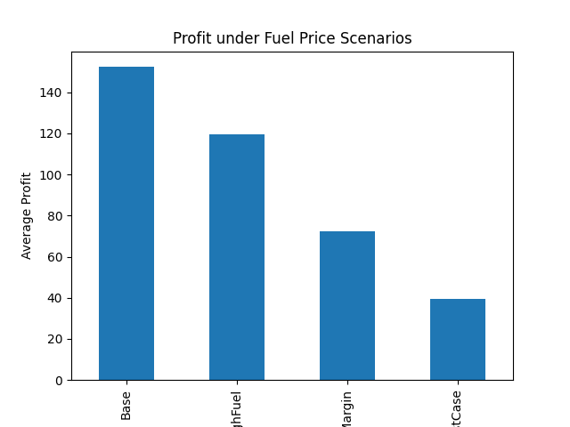
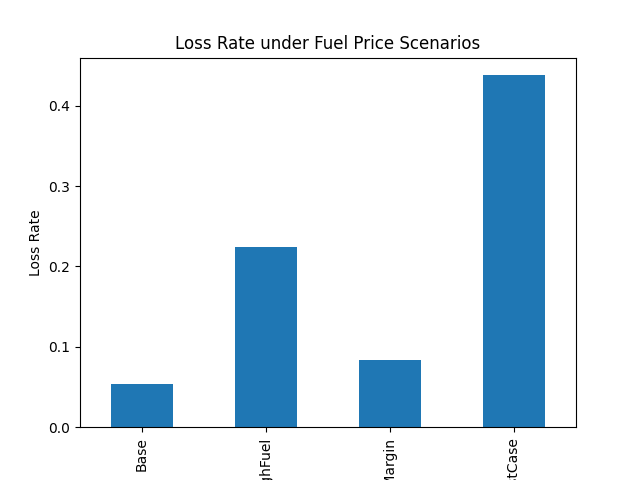
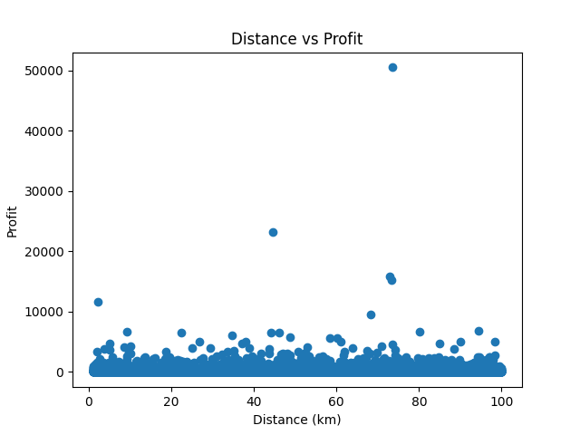

# 🚚 E-commerce Logistics Profit Simulation under Fuel Cost Scenarios

## 👤 Role
Data Analyst (Personal Project)
Responsible for data cleaning, simulation modeling, and business insights generation

## 📊 Project Overview

This project analyzes the impact of fuel price changes on logistics cost and profit in an e-commerce setting.  
By simulating different fuel price scenarios, the analysis evaluates how operational costs affect profitability and identifies high-risk orders.

## 🧾 Data Source

Online Retail Dataset from Kaggle  
https://www.kaggle.com/code/hellbuoy/online-retail-k-means-hierarchical-clustering/input  

The dataset contains transactional data from a UK-based online retail company.  
This dataset is used for educational and analytical purposes only.

## 🎯 Objectives

- Analyze how fuel price changes affect logistics cost and profit  
- Simulate different operational scenarios  
- Identify high-risk orders  
- Provide data-driven optimization strategies  

## ⚙️ Methodology

1. Data Cleaning  
   - Removed cancelled orders (InvoiceNo starts with 'C')  
   - Filtered invalid data (Quantity <= 0, UnitPrice <= 0)  

2. Order Aggregation  
   - Grouped transactions into orders using InvoiceNo  
   - Calculated total order value  

3. Logistics Simulation  
   - Generated delivery distance (1–100 km)  
   - Estimated logistics cost based on distance  

4. Scenario Simulation  
   - Base  
   - High Fuel Cost  
   - Low Margin  
   - Worst Case  

## 📈 Results

- Profit decreases as fuel cost increases  
- Low margin significantly reduces profitability  
- Worst-case scenario shows substantial profit decline  
- Loss rate increases under high fuel and low margin conditions

  ### Key Metrics

- Base Profit: ~136  
- Worst Case Profit: ~31  
- Loss Rate: 14% → 49%

## 💡 Business Insights

- Low-value and long-distance orders are more likely to incur losses  
- Fuel cost is a critical factor in logistics profitability  
- Margin management plays a key role in sustaining profit  

### Suggested Strategies

- Set minimum order thresholds  
- Adjust shipping fees based on distance  
- Optimize product pricing and margin  
- Identify and manage high-risk orders proactively  

## 📷 Visualization

### Profit by Scenario

### Loss Rate by Scenario

### Distance vs Profit

## ⚙️ Assumptions

- Delivery distance is simulated using a uniform distribution (1–100 km) due to lack of real logistics data  
- This simplification allows controlled scenario analysis of fuel cost impact  
