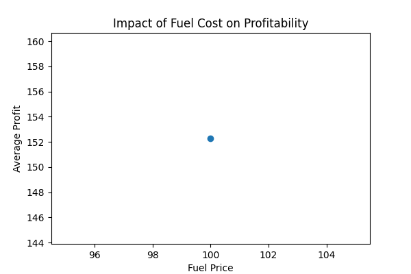

# 🚚 E-commerce Logistics Profit Simulation under Fuel Cost Scenarios

## 📌 Executive Summary

This project analyzes the impact of fuel cost fluctuations on e-commerce logistics profitability through scenario simulation.

Key findings indicate that fuel cost is a major driver of profit variability, with loss rates increasing significantly under high-cost conditions (from 14% to 49%).

The analysis highlights that low-value and long-distance orders contribute most to losses, suggesting that pricing and delivery strategies must be adjusted to maintain profitability.

Recommended actions include setting minimum order thresholds, optimizing delivery zones, and improving margin control.

## 👤 Role
Data Analyst (Personal Project)
Responsible for data cleaning, simulation modeling, and business insights generation

## 📊 Project Overview

This project analyzes the impact of fuel price changes on logistics cost and profit in an e-commerce setting.  
By simulating different fuel price scenarios, the analysis evaluates how operational costs affect profitability and identifies high-risk orders.

## 🧾 Data Source

Online Retail Dataset from Kaggle  
https://www.kaggle.com/code/hellbuoy/online-retail-k-means-hierarchical-clustering/input  

The dataset contains transactional data from a UK-based online retail company.  
This dataset is used for educational and analytical purposes only.
Used for simulation and analytical demonstration purposes

## 🎯 Objectives

- Analyze how fuel price changes affect logistics cost and profit  
- Simulate different operational scenarios  
- Identify high-risk orders  
- Provide data-driven optimization strategies  

## ⚙️ Methodology

1. Data Cleaning  
   - Removed cancelled orders (InvoiceNo starts with 'C')  
   - Filtered invalid data (Quantity <= 0, UnitPrice <= 0)  

2. Order Aggregation  
   - Grouped transactions into orders using InvoiceNo  
   - Calculated total order value  

3. Logistics Simulation  
   - Generated delivery distance (1–100 km)  
   - Estimated logistics cost based on distance  

4. Scenario Simulation  
   - Base  
   - High Fuel Cost  
   - Low Margin  
   - Worst Case  

## 📈 Results

- Profit declines significantly as fuel cost increases, indicating high sensitivity to fuel price changes  
- Low-margin scenarios result in a sharp drop in profitability, increasing financial risk  
- In worst-case conditions, loss rate rises from 14% to 49%, indicating a high proportion of unprofitable orders  
- The combination of high fuel cost and low margin leads to a sharp increase in loss rate   
- Worst-case scenario shows substantial profit decline  
- Loss rate increases under high fuel and low margin conditions
  
---

  ### Key Metrics

- Base Profit: ~136  
- Worst Case Profit: ~31 (approx. 77% decline under adverse conditions)  
- Loss Rate: 14% → 49% (indicating a significant increase in unprofitable orders)  
- Profit Margin = Profit / Revenue  
- Cost per Order = Total Cost / Number of Orders

## 📊 Profit vs Fuel Price

*Figure 1: Impact of fuel price changes on profitability*
- This chart shows that as fuel prices increase, profitability declines, indicating that fuel cost is a key driver of logistics performance.

## 🔍 Key Findings

- Fuel cost is the most significant factor  
- Profit decreases as fuel price increases  
- Delivery efficiency amplifies the impact

---

## 💡 Business Insights

- Low-value and long-distance orders are the primary drivers of losses  
- Fuel cost volatility introduces significant uncertainty into logistics profitability  
- Margin control is critical to maintaining stable financial performance
- Without pricing or operational adjustments, profit erosion becomes significant under adverse scenarios  

---

### Suggested Strategies

- Set minimum order thresholds  
- Adjust shipping fees based on distance  
- Optimize product pricing and margin  
- Identify and manage high-risk orders proactively  

## 📷 Visualization

### Profit by Scenario
  
*Figure 2: Profit comparison across different scenarios*

### Loss Rate by Scenario
  
*Figure 3: Loss rate under different operational scenarios*

### Distance vs Profit
  
*Figure 4: Relationship between delivery distance and profitability

## ⚙️ Assumptions

- Delivery distance is simulated using a uniform distribution (1–100 km) due to lack of real logistics data  
- This simplification allows controlled scenario analysis of fuel cost impact
- Results should be interpreted as directional insights rather than exact predictions 
